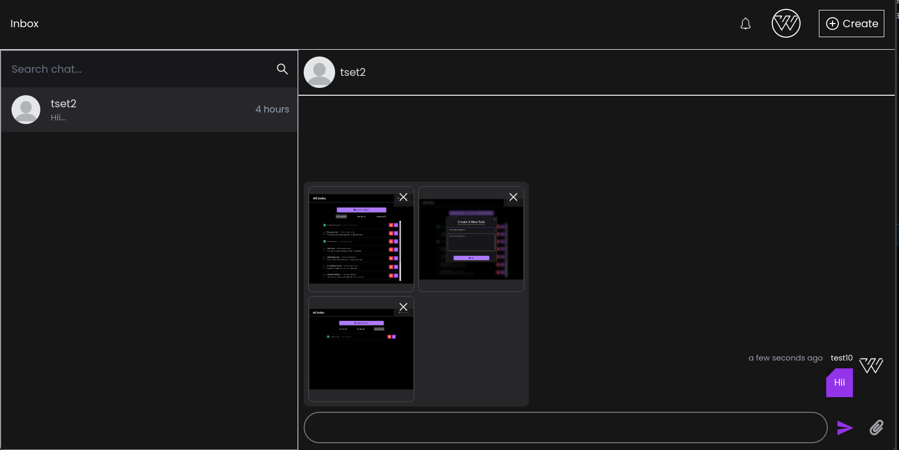
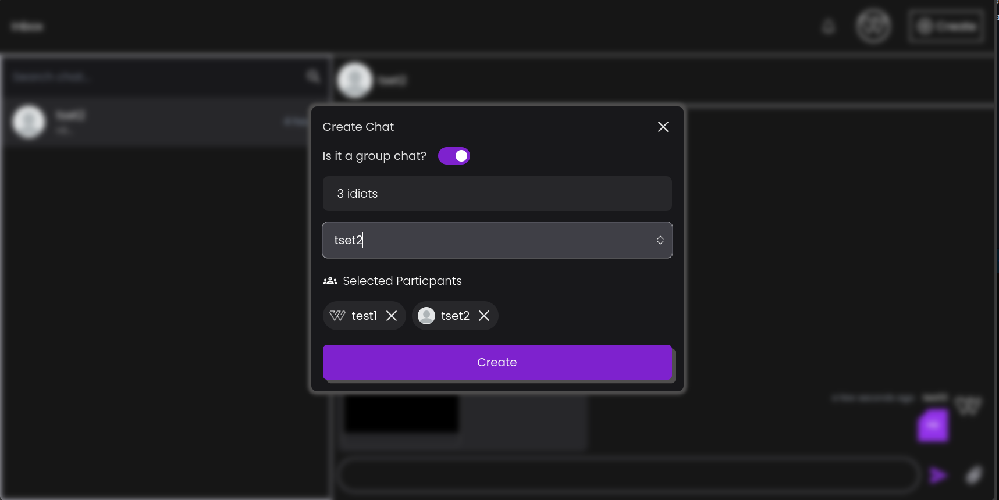
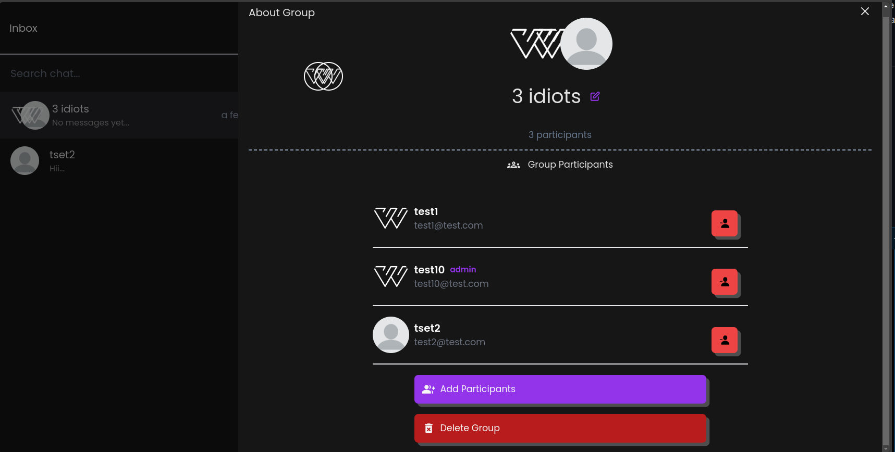
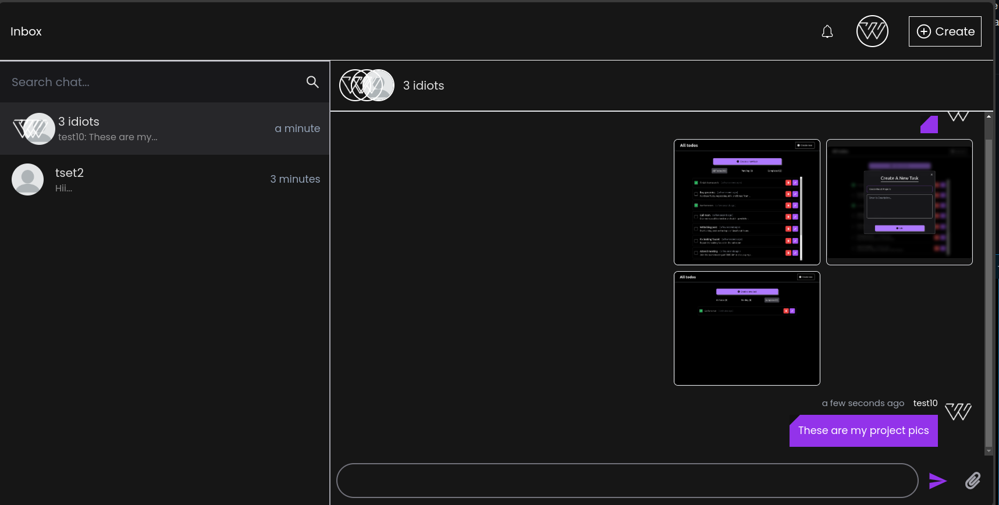

# MERN Stack Chat App 
[click here]("https://ichat-teal.vercel.app") to see live app.

Welcome to the detailed documentation for the MERN Stack Chat App. This app utilizes the MERN (MongoDB, Express.js, React.js, Node.js) stack along with additional technologies to create a real-time chat application. Below you'll find information on the technologies used, features implemented.

## Technologies Used

- **Frontend**:
  - React.js: A JavaScript library for building user interfaces.
  - Tailwind CSS: A utility-first CSS framework.
  - Context API: For managing global state within React components.
- **Backend**:
  - Node.js: A JavaScript runtime built on Chrome's V8 JavaScript engine.
  - Express.js: A web application framework for Node.js.
  - MongoDB: A NoSQL database used to store chat data.
  - Socket.io: A library enabling real-time, bidirectional, and event-based communication.

## Features

1. **Real-time One-on-One Chat**: Users can engage in real-time conversations with each other privately.
2. **Real-time Group Chat**: Users can create groups and chat with multiple participants in real-time.
3. **Group Admin Functionality**: Group admins have additional privileges such as adding or removing members, deleting messages, etc.
4. **Typing Effect**: Provides a visual indication when someone is typing in the chat.
5. **Create/Delete One-on-One/Group Chat**: Users can create new chat rooms, either one-on-one or group chats, and delete them as needed.
6. **Send Images**: Users are able to send images along with text messages

## Screenshots

1.  

2.  

3.  

4.  
